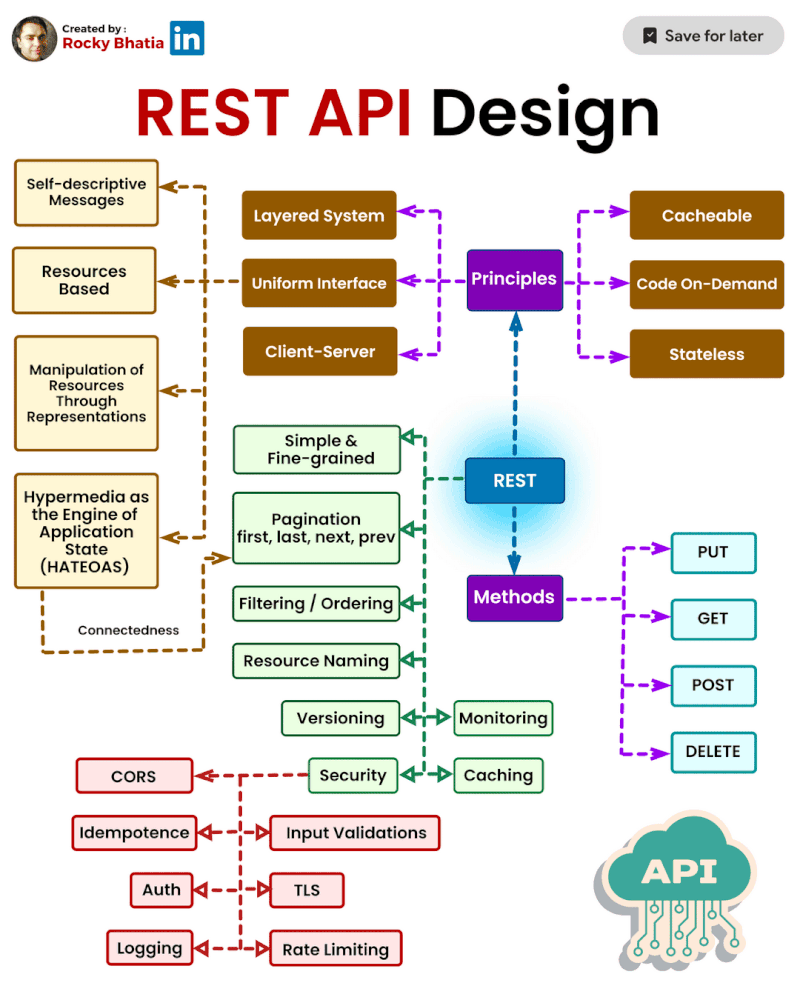

# Interview Prep & Materials

<!-- QUESTIONS_START -->

### <ins>JavaScript Interview Q&A </ins>

[Sudheerj - Javascript Interview- Questions](https://github.com/sudheerj/javascript-interview-questions/tree/master)

### <ins>Forward proxy vs. Reverse proxy</ins>

#### 𝗙𝗼𝗿𝘄𝗮𝗿𝗱 𝗣𝗿𝗼𝘅𝘆: A forward proxy server sits between a client (like a web browser) and the internet. It acts as an intermediary for requests from the client seeking resources on other servers. Here’s how it works:

- 𝗣𝗿𝗶𝘃𝗮𝗰𝘆 & 𝗔𝗻𝗼𝗻𝘆𝗺𝗶𝘁𝘆: Users can hide their IP addresses and locations by routing through the proxy, which can mask their identity.
- 𝗖𝗼𝗻𝘁𝗲𝗻𝘁 𝗙𝗶𝗹𝘁𝗲𝗿𝗶𝗻𝗴: Often used by organizations to block access to certain sites or monitor employee internet usage.
- 𝗖𝗮𝗰𝗵𝗶𝗻𝗴: Speeds up access to frequently visited websites by storing copies of web pages, saving time and bandwidth.
- 𝗘𝘅𝗮𝗺𝗽𝗹𝗲 𝗨𝘀𝗲 𝗖𝗮𝘀𝗲: A company implementing a forward proxy for employees to access the internet, with controls to monitor or restrict certain websites.

#### 𝗥𝗲𝘃𝗲𝗿𝘀𝗲 𝗣𝗿𝗼𝘅𝘆: A reverse proxy sits between the internet and a web server, forwarding client requests to the appropriate backend server. Its purpose is quite different:

- 𝗟𝗼𝗮𝗱 𝗕𝗮𝗹𝗮𝗻𝗰𝗶𝗻𝗴: It can distribute incoming traffic across multiple servers, improving performance and preventing overload.
- 𝗦𝗲𝗰𝘂𝗿𝗶𝘁𝘆: Helps protect backend servers by hiding their identities and filtering out malicious traffic.
- 𝗖𝗮𝗰𝗵𝗶𝗻𝗴 & 𝗖𝗼𝗺𝗽𝗿𝗲𝘀𝘀𝗶𝗼𝗻: Often used to cache responses or compress content to speed up delivery.
- 𝗦𝗦𝗟 𝗧𝗲𝗿𝗺𝗶𝗻𝗮𝘁𝗶𝗼𝗻: Offloads SSL encryption/decryption to reduce server load.
- 𝗘𝘅𝗮𝗺𝗽𝗹𝗲 𝗨𝘀𝗲 𝗖𝗮𝘀𝗲: A website using a reverse proxy to route user requests to multiple web servers behind the scenes, improving scalability and uptime.

In summary, 𝗳𝗼𝗿𝘄𝗮𝗿𝗱 𝗽𝗿𝗼𝘅𝗶𝗲𝘀 are used by clients to access the internet with privacy and control, while 𝗿𝗲𝘃𝗲𝗿𝘀𝗲 𝗽𝗿𝗼𝘅𝗶𝗲𝘀 are used by servers to manage traffic and improve security and performance.
Both are invaluable tools but serve opposite ends of the client-server relationship!

### <ins>REST API Design</ins>

#### Key Principles for REST API Design:

- Use HTTP methods (GET, POST, PUT, DELETE) for clarity.
- Cache responses to boost performance.
- Ensure each client request is self-contained, with no server-side state storage.
- Provide fine-grained control over resources for efficiency.
- Support pagination, filtering, and ordering for large datasets.
- Interconnect resources for easy discoverability.
- Prioritise security with authentication and authorization.

#### Best Practices for Implementation:

- Implement versioning to handle changes smoothly.
- Use self-descriptive messages to improve usability.
- Include HATEOAS to guide clients through resources.
- Use a layered, consistent interface for modularity and clarity.
- Enable CORS and idempotence for safe, predictable operations.
- Focus on security with authentication, logging, and input validation.
- Secure data with TLS and manage load with rate limiting.

#### Conclusion:
Designing an effective REST API is crucial for building scalable, secure, and interconnected digital solutions. By following these principles, developers can create APIs that drive innovation and elevate the user experience in a rapidly evolving tech world.

<!-- QUESTIONS_END -->
